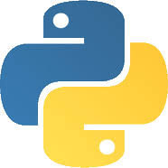
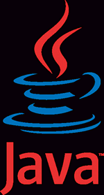

<h1 align="center">Hi there, I'm Demada Chetan Reddy 👋</h1>

  
  

---

### 🚀 About Me
- 💻 Backend Engineer specializing in Python & Java.
- 🎯 Passionate about building scalable and efficient APIs.
- 📈 Currently working on becoming an SDE2 at a tier-1 company.
- 🏆 Exploring Golang as my next language.
- 💡 Learning three new English words every day!

### 🛠 Tech Stack
🚀 Programming Languages

  
  
  
  

### 📈 GitHub Stats

  

### 📫 How to reach me
- 💼 [LinkedIn](https://linkedin.com/in/yourusername)
- 📧 Email: your.email@example.com
- 🌎 [Portfolio](https://yourwebsite.com)

---

Thanks for visiting! 🚀✨

